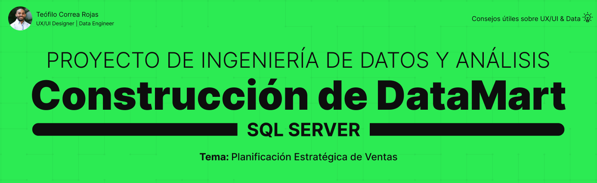

Este proyecto consiste en la construcción de un **DataMart en estrella** a partir de fuentes planas en formato **CSV y Excel**.

El objetivo es simular un flujo profesional de **staging → dimensiones → hechos**, aplicando buenas prácticas de **exploración (EDA), gobernanza de datos y modelado dimensional**.  

El resultado es un modelo confiable y documentado, listo para ser consumido en **Power BI** o **DataSpell** para análisis de negocio.  

---

## 🎯 Objetivos
- **Ingesta en Staging:** cargar archivos CSV/Excel en tablas espejo (`stg.*`).  
- **EDA en Staging:** identificar nulos, duplicados, valores inválidos y rangos.  
- **Modelado Dimensional:** crear tablas `dim_*` y `fact_strategy_plan`.  
- **Relaciones en Estrella:** enlazar la FACT con sus DIM mediante claves foráneas.  
- **Validación:** comprobar consistencia entre staging y DataMart final.  

---

## 📂 Estructura del repositorio

---

## 📊 Modelo Estrella (Dimensiones y Hechos)

- **Dimensiones**:  
  - `dim_account`  
  - `dim_date`  
  - `dim_entity`  
  - `dim_product_category`  
  - `dim_scenario`  

- **Hechos**:  
  - `fact_strategy_plan` (ventas planificadas, enlazada a todas las DIM)  

👉 Relaciones: 1–N de cada DIM hacia la FACT.  

---

## 🗂️ Flujo de trabajo

1. **Staging:** cargar fuentes originales en `stg.*`.  
2. **EDA:** explorar calidad de datos (conteos, nulos, duplicados).  
3. **Dimensiones:** crear `dim_*` deduplicadas con surrogate keys.  
4. **Hechos:** poblar `fact_strategy_plan` con métricas y FKs.  
5. **Validación:** comparar totales entre staging y DataMart final.  

---

## ✅ Alcance
Este es un proyecto educativo orientado a **Data Engineering y Data Analysis**.  
No utiliza herramientas ETL avanzadas, sino que aplica la lógica de transformación y control de calidad mediante **SQL puro**, reforzando el entendimiento práctico del flujo **staging → dim → fact**.

---

## 👤 Autor

**Teófilo Correa Rojas**  
UX/UI Designer • Data Engineer
[LinkedIn](https://www.linkedin.com/in/teófilo-correa-rojas/) · [GitHub](https://github.com/teofilocorrea)
